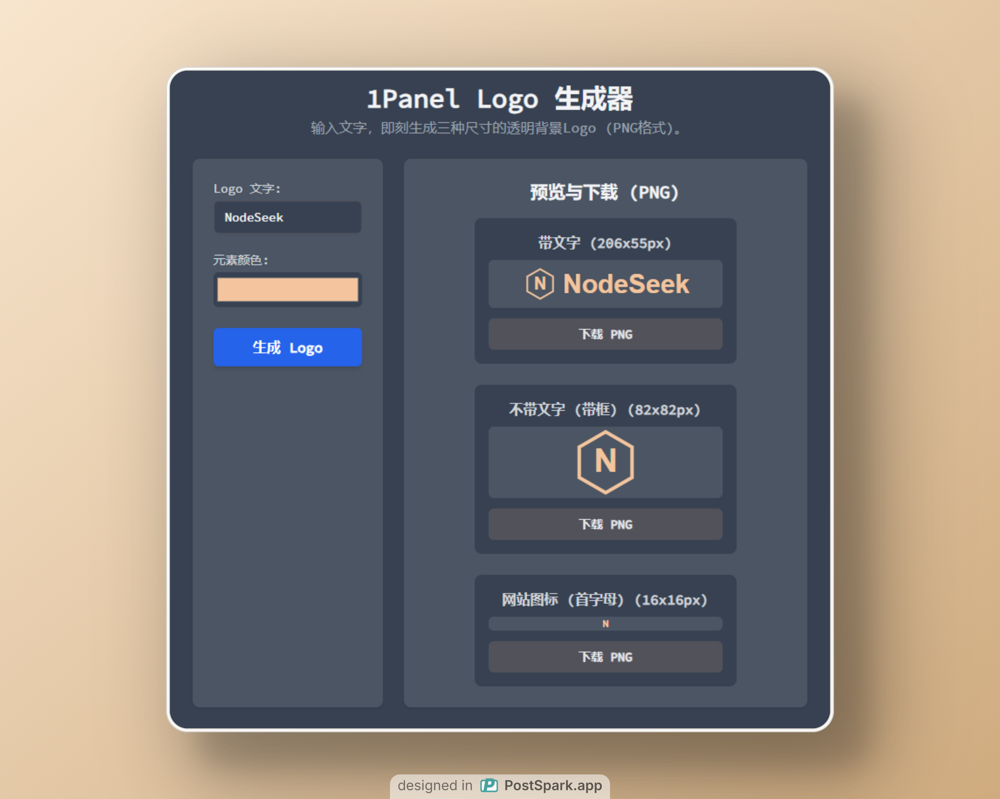

# 1Panel Logo 生成器

欢迎使用 1Panel Logo 生成器！这是一个简单好用的在线工具，可以帮助您根据输入的文字快速生成 1Panel 控制面板所需的自定义 Logo 图片。

## ✨ 主要功能

  * **文字转 Logo**：输入您想要的文字，即可自动生成符合 1Panel 规范的 Logo。
  * **即时预览**：在您输入文字的同时，实时查看到 Logo 的效果。
  * **简单易用**：无需复杂操作，一键生成。
  * **为 1Panel 定制**：专门为 1Panel 用户设计，解决自定义 Logo 的需求。

## ⚠️ 当前限制

  * **仅支持深色模式**：目前生成的 Logo 主要适配 1Panel 的深色主题背景。浅色模式下的 Logo 支持正在开发中。

## 🚀 体验地址

您可以直接访问以下链接在线体验：

[➡️ 点击这里，在线生成您的 1Panel Logo](https://1panel-logo.vercel.app/)

## 🖼️ 效果演示

以下是一些使用本工具生成的 Logo 效果图：

1Panel 默认文字效果

NodeSeek 文字效果

## 🛠️ 如何使用

1.  访问 [体验地址](https://1panel-logo.vercel.app/)。
2.  在页面上的输入框中，键入您希望 Logo 显示的文字。
3.  Logo 图片将会根据您的输入自动生成并显示在预览区域。
4.  （根据实际功能添加）右键点击图片或使用页面提供的下载按钮，即可保存生成的 Logo 图片到您的本地设备。
5.  将下载的图片上传到您的 1Panel 设置中作为自定义 Logo 使用。

## 💡 未来计划 (Roadmap)

我们计划在未来的版本中加入更多功能，例如：

  * [ ] 支持浅色模式 Logo 的生成。
  * [ ] 提供更多字体选择。
  * [ ] 允许自定义文字颜色和大小。
  * [ ] 支持简单的图标或背景元素搭配。
  * [ ] 优化生成逻辑，提高图片质量。

## 🤝 如何贡献

欢迎您为这个项目做出贡献！如果您有任何好的建议、发现了 Bug，或者想要添加新的功能，请随时提出 issue
